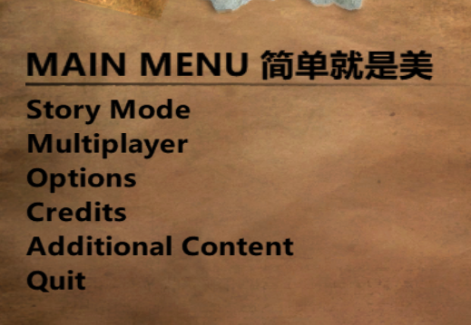

# FC2MFTConverter
FC2MFTConverter is a tool used for creating/editing custom bitmap fonts for Far Cry 2

## Installation

- Donwload [lastest release](https://github.com/eprilx/FFDConverter/releases).
- Run FC2MFTConverter.exe in the cmd

## Building from source
- **[Install .NET 5](https://dotnet.microsoft.com/download/dotnet/5.0)**
- ``git clone --recurse-submodules https://github.com/eprilx/FC2MFTConverter.git``

## Test in-game



## Usage

```
Usage: FC2MFTConverter [OPTIONS]
Options:
      --fnt2mft              Convert FNT to MFT
      --mft2fnt              Convert MFT to FNT
```
❄ Convert FNT to MFT (Create new MFT)
```
Usage: FC2MFTConverter --fnt2mft [OPTIONS]
Options:
  -f, --originalMFT=VALUE    (required) Original MFT file (*.mft)
  -b, --charDesc=VALUE       (required) Character description file (*.fnt)
  -o, --NewMFT=VALUE         (optional) Output new MFT file
```
❄ Convert MFT to FNT
```
Usage: FC2MFTConverter --mft2fnt [OPTIONS]
Options:
  -f, --originalMFT=VALUE    (required) Original MFT file (*.mft)
  -o, --NewFNT=VALUE         (optional) Output FNT file
```
❄ Example:
```
FC2MFTConverter --fnt2mft -f farcry2_25.mft -b yahei.fnt -o farcry2_25.mft.new
FC2MFTConverter --mft2fnt -f farcry2_25.mft -o farcry2_25.mft.fnt
```

- farcry2_25.mft is the file you get when unpack game files.
- yahei.fnt is a character descriptions file generated by [BMFont](https://www.angelcode.com/products/bmfont/)
- farcry2_25.mft.fnt is a character descriptions file exported from original MFT

*Note 1: After replace \*.mft file, you need to replace image file in-game (e.g. farcry2_25_0.xbt)*

## Special Thanks
- [abodora](https://github.com/abodora) (providing sample files)
- [Rick Gibbed](https://github.com/gibbed) ([Gibbed.IO](https://github.com/gibbed/Gibbed.IO) library)

## License
[MIT](LICENSE)
